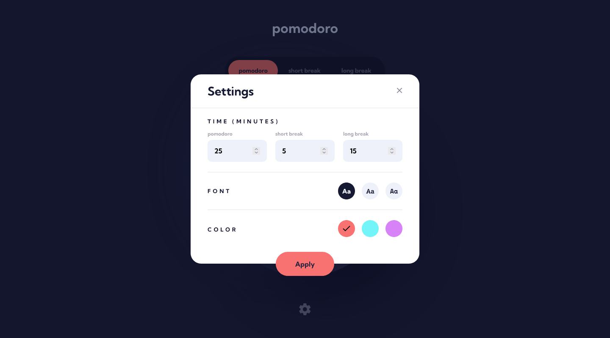

# Frontend Mentor - Pomodoro app solution

This is a solution to the [Pomodoro app challenge on Frontend Mentor](https://www.frontendmentor.io/challenges/pomodoro-app-KBFnycJ6G). Frontend Mentor challenges help you improve your coding skills by building realistic projects.

## Table of contents

- [Overview](#overview)
  - [The challenge](#the-challenge)
  - [Links](#links)
- [My process](#my-process)
  - [Built with](#built-with)
  - [Useful resources](#useful-resources)
- [Author](#author)
- [Screenshots](#screenshots)

## Overview

### The challenge

Users should be able to:

- Set a pomodoro timer and short & long break timers
- Customize how long each timer runs for
- See a circular progress bar that updates every ~~minute~~ second and represents how far through their timer they are
- Customize the appearance of the app with the ability to set preferences for colors and fonts

### Links

- Solution URL: [Frontend Mentor Solution Page](https://your-solution-url.com)
- Live Site URL: [GitHub Pages Site](https://karolbanat.github.io/fem-pomodoro-app/)

## My process

### Built with

- Semantic HTML5 markup
- CSS custom properties
- SCSS
- Flexbox
- CSS Grid
- Mobile-first workflow
- Vanilla JS / TypeScript

### Useful resources

- [Circular Progress Bar](https://www.youtube.com/watch?v=H2HYccAGR00) - How to make progress bar
- [MDN SVG tutorial](https://developer.mozilla.org/en-US/docs/Web/SVG/Tutorial) - About SVGs
- [Trapping focus in modal](https://uxdesign.cc/how-to-trap-focus-inside-modal-to-make-it-ada-compliant-6a50f9a70700)
- [Video from Web Dev Simplified](https://www.youtube.com/watch?v=5iGGvJn8K1U) - Convinced me to put helper functions at the bottom

## Author

- Frontend Mentor - [@karolbanat](https://www.frontendmentor.io/profile/karolbanat)

## Screenshots

