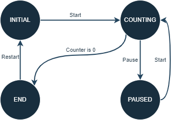
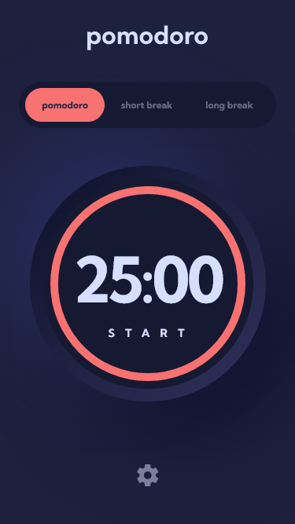
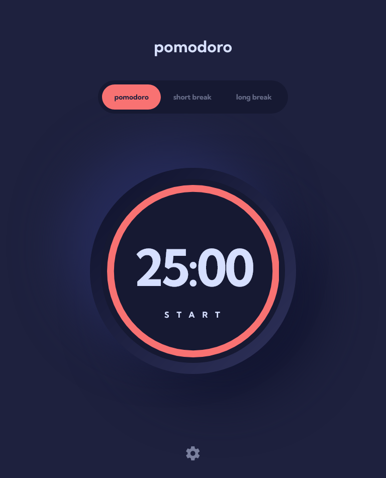
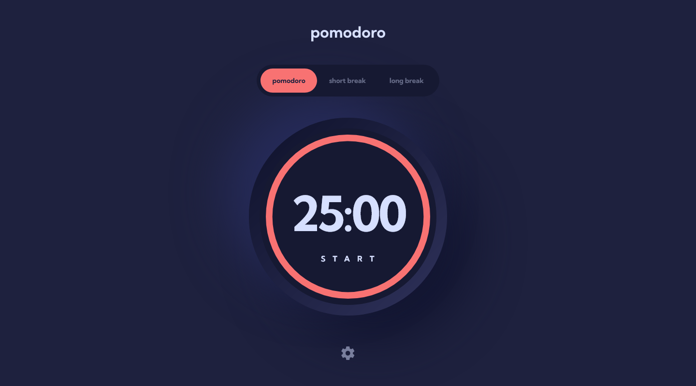
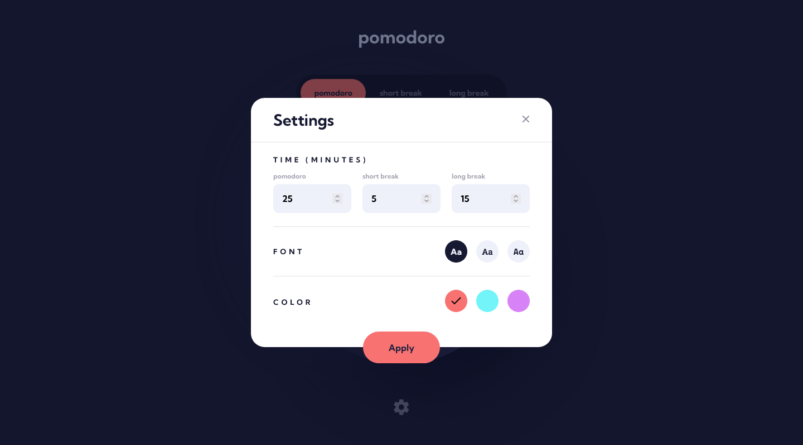

# Frontend Mentor - Pomodoro app solution

This is a solution to the [Pomodoro app challenge on Frontend Mentor](https://www.frontendmentor.io/challenges/pomodoro-app-KBFnycJ6G). Frontend Mentor challenges help you improve your coding skills by building realistic projects.

## Table of contents

- [Overview](#overview)
  - [The challenge](#the-challenge)
  - [Links](#links)
- [My process](#my-process)
  - [Built with](#built-with)
  - [State buttons](#state-buttons)
  - [MVC pattern](#mvc-pattern)
  - [Observer design pattern](#observer-design-pattern)
  - [Timer states](#timer-states)
  - [Useful resources](#useful-resources)
- [Author](#author)
- [Screenshots](#screenshots)

## Overview

### The challenge

Users should be able to:

- Set a pomodoro timer and short & long break timers
- Customize how long each timer runs for
- See a circular progress bar that updates every ~~minute~~ second and represents how far through their timer they are
- Customize the appearance of the app with the ability to set preferences for colors and fonts

### Links

- Solution URL: [Frontend Mentor Solution Page](https://www.frontendmentor.io/solutions/pomodoro-app-KA6o22mBaJ)
- Live Site URL: [GitHub Pages Site](https://karolbanat.github.io/fem-pomodoro-app/)

## My process

### Built with

- Semantic HTML5 markup
- CSS custom properties
- SCSS
- Flexbox
- CSS Grid
- Mobile-first workflow
- Vanilla JS / TypeScript

### State buttons

I called them state buttons, but those are the buttons above the timer to choose which time to run (pomodoro, short break, long break). At first I did them as a group of `<button>` elements. At the end I changed my mind and switched them to **custom radio buttons**: `<input>` elements wrapped in custom class. Then wrapped them in a `<form>`.

### Timer `role=timer`

I used a `role=timer` on the element displaying remaining time. At the end of the countdown the `aria-live` attribute, which is by default set to **off**, is changed to **polite**. After restarting the timer, it is then changed back to **off**.

### MVC pattern

In this project I wanted to test the **MVC** (Model-View-Controller) desing pattern. Used it just for the timer functionality.

The **Model** in this project is the timer `PomodoroTimer` implemented with `Timer` interface. It allows to `start`, `pause` and `restart` the timer. Also stores its **state**.

For the **View** in this project I went with a simple class `TimerView` containing elements realted to the timer. It implements the `Observer` interface, allowing it to update when **Model** changes its time or state.

The **Controller** in this project contains the Model and the View. After receiving the model through constructor, it creates new View and registers it as **Observer** to the `PomodoroTimer`. Also when creating View, it passes the function that will be executed when the button in the View will be clicked. Here, it will start, pause or restart timer depending on the timer's current state.

### Observer design pattern

Here I implemented **Observer** design pattern for the Model and the View. The Model is **Observable** (or **Subject**), and implements `Observable` interface. It allows to register observers to that object and to send updates when it changes.

The **Observer** interface has just one method, `update`, that should execute when _observed_ objects change.

At first I wanted to either send all updates as separate arguments in the `update` method or pass the Model to the View through constructor and then get needed updates. At the end I decided that in the `update` method I will pass the **Observable** object as argument, then in the View cast it to the needed type and get updates.

### Timer states

Action performed on timer by Controller depends on timer's current state.
The states are as follow:

.

Timer start wit **INITAL** state. After pressing _start_ it goes to **COUNTING** state in which it updates it state every second. When during counting pause is pressed, it goes to **PAUSED**. In **PAUSED** state after pressing start, it returns to **COUNTING** state.

When counting ends (`countingTime` reaches 0), it goes to **END** state. In this state timer can be restarted. After restarting it goes to its **INITAL** state.

### Useful resources

- [Circular Progress Bar](https://www.youtube.com/watch?v=H2HYccAGR00) - How to make progress bar
- [MDN SVG tutorial](https://developer.mozilla.org/en-US/docs/Web/SVG/Tutorial) - About SVGs
- [Trapping focus in modal](https://uxdesign.cc/how-to-trap-focus-inside-modal-to-make-it-ada-compliant-6a50f9a70700)
- [MDN - timer role](https://developer.mozilla.org/en-US/docs/Web/Accessibility/ARIA/Roles/timer_role)
- [Video from Web Dev Simplified](https://www.youtube.com/watch?v=5iGGvJn8K1U) - Convinced me to put helper functions at the bottom

## Author

- Frontend Mentor - [@karolbanat](https://www.frontendmentor.io/profile/karolbanat)

## Screenshots

